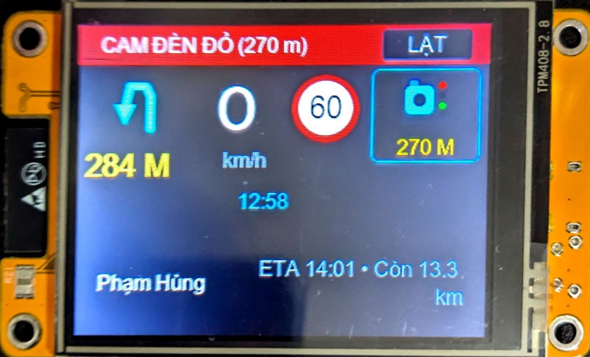

# WazeHUD CYD — Head-Up Display cho Waze Mod

[](https://platformio.org/)
[-yellow.svg)](https://github.com/witnessmenow/ESP32-Cheap-Yellow-Display)
[]()
[]()
[]()

> **WazeHUD CYD** là một dự án cuối tuần (weekend project) xây dựng thiết bị hiển thị thông tin dẫn đường (Head-Up Display / Dashboard Display) rời trên bảng mạch phát triển giá rẻ **ESP32-2432S028** (thường gọi là *Cheap Yellow Display - CYD*), nhận dữ liệu thời gian thực trực tiếp từ ứng dụng **Waze Mod** qua kết nối **Bluetooth Classic (SPP)** và **WiFi WebSocket**.

---

## 🌟 Lời cảm ơn đặc biệt & Nguồn gốc dự án (Acknowledgments)

Dự án này là một **weekend project** được phát triển và hiện thực hóa dựa trên tài liệu đặc tả giao thức **HLP/1 (HUD Link Protocol)** và các hướng dẫn cộng đồng từ:

👉 **[https://wazemod.io.vn/](https://wazemod.io.vn/)**

Chân thành cảm ơn đội ngũ phát triển và cộng đồng **Waze Mod Việt Nam** tại **[wazemod.io.vn](https://wazemod.io.vn/)**. Dự án WazeHUD hoạt động dựa hoàn toàn vào dữ liệu phát ra từ bản **Waze Mod** được cung cấp từ website này. Nhờ có các bản mod tối ưu cho giao thông Việt Nam (cảnh báo camera phạt nguội, tốc độ giới hạn, đoạn đường cấm vượt, cảnh báo giao thông...) cùng giao thức mở HLP/1 mà dự án phần cứng này có thể ra đời một cách trọn vẹn.

---

<p align="center">
  
  <br>
  <em>Giao diện hiển thị thực tế của WazeHUD CYD v1.5.0 trên xe hơi: Cảnh báo Camera phạt nguội, tốc độ thực tế, biển giới hạn tốc độ thường trực 60 và nút LẬT hắt kính lái</em>
</p>

---

## 📸 Tính năng nổi bật

- **Kết nối Bluetooth Classic SPP tự động**: Pair thiết bị với tên `WazeHUD`, mở Waze Mod là tự nhận diện và stream dữ liệu tức thì ở tần số cao (8 Hz).
- **Hỗ trợ kết nối phụ qua WiFi WebSocket**: Chạy server WebSocket `ws://<ip>:8765/hlp` song song.
- **Giao diện Ngang (Landscape 320 × 240) tràn viền**: Tối ưu 100% diện tích màn hình 2.8", thiết kế hiện đại, độ tương phản cao chuyên dụng đặt taplo xe hơi ban ngày lẫn ban đêm.
- **Hỗ trợ tiếng Việt đầy đủ Unicode**: Tên đường tiếng Việt có dấu (`Nguyễn Trãi`, `Khuất Duy Tiến`...), tự động cuộn chữ mượt mà nếu tên đường quá dài.
- **Cảnh báo giao thông Việt Nam đặc thù**:
  - Tốc độ thực tế + Cảnh báo chạy quá tốc độ (đổi màu đỏ).
  - Biển báo tốc độ giới hạn tròn viền đỏ.
  - Mũi tên chỉ hướng rẽ trực quan + khoảng cách đến khúc rẽ + tên đường tiếp theo.
  - **Đoạn đường cấm vượt (`avg=1`)**: Tự động hiển thị thanh tiến trình và khoảng cách đếm lùi hết cấm vượt (đặc thù bản đồ Waze Việt Nam).
  - Thanh cảnh báo khẩn cấp (Camera tốc độ, Camera phạt nguội, CSGT, Đoạn đường nguy hiểm...).
  - Giờ đến dự kiến (ETA) và Quãng đường còn lại.
- **Tự động nhận diện mất kết nối**: Màn hình chuyển sang trạng thái chờ thông minh khi dừng điều hướng hoặc ngắt kết nối quá 3 giây.
- **Tương thích cả 2 phiên bản CYD**: Hỗ trợ bản CYD 1-USB (ILI9341) và CYD 2-USB Type-C (ST7789).

---

## 🛠️ Phần cứng hỗ trợ

| Thành phần | Thông số |
|---|---|
| **Board mạch** | ESP32-2432S028 (CYD — Cheap Yellow Display) |
| **SoC** | ESP32 Dual Core (Xtensa LX6, 240 MHz, 520 KB SRAM, 4 MB Flash) |
| **Màn hình** | 2.8 inch LCD TFT, độ phân giải 320 × 240 px (Landscape) |
| **Driver LCD** | ST7789 (cho bản 2 cổng USB Type-C + Micro) hoặc ILI9341 |
| **Đèn nền (Backlight)** | Điều khiển độ sáng qua PWM GPIO 21 |
| **Giao thức** | Bluetooth Classic 2.0+EDR (SPP) & WiFi 802.11 b/g/n |

---

## 📂 Cấu trúc thư mục dự án

```
WazeHUD/
├── README.md                 ← Tài liệu giới thiệu tổng quan dự án
├── CHANGELOG.md              ← Nhật ký thay đổi và lịch sử các phiên bản
├── GEMINI.md                 ← Bản quy tắc & ràng buộc kiến trúc cho AI Agent
├── bin/                      ← Chứa file binary build sẵn nạp ngay
│   ├── wazehud_cyd_factory_all_in_one_0x0.bin  (Bản mới nhất - v1.3.0)
│   ├── wazehud_cyd_v1.2.0_factory_0x0.bin      (Bản v1.2.0)
│   ├── wazehud_cyd_v1.1.0_factory_0x0.bin      (Bản v1.1.0)
│   └── wazehud_cyd_v1.0.0_factory_0x0.bin      (Bản v1.0.0)
├── docs/                     ← Hệ thống tài liệu chi tiết
│   ├── ARCHITECTURE.md       ← Kiến trúc FreeRTOS, luồng dữ liệu & bộ nhớ
│   ├── HARDWARE.md           ← Sơ đồ chân pinout chi tiết ESP32 CYD
│   ├── DISPLAY_LAYOUT.md     ← Tọa độ bố cục pixel và mã màu HUD
│   ├── PROTOCOL_NOTES.md     ← Chi tiết giao thức HLP/1, handshake & xử lý dữ liệu
│   ├── BUILD.md              ← Hướng dẫn biên dịch PlatformIO & tạo font tiếng Việt
│   ├── TEST_PLAN.md          ← Ma trận kiểm thử phần cứng
│   └── waze-hud-link-sdk-ai-bundle.md ← Toàn văn tài liệu SDK đặc tả HLP/1
└── firmware/                 ← Mã nguồn C++ PlatformIO
    ├── platformio.ini        ← Cấu hình PlatformIO, driver màn hình & thư viện
    └── src/
        ├── main.cpp          ← Khởi tạo FreeRTOS tasks & điều phối
        ├── config.h          ← Tập trung toàn bộ hằng số chân GPIO & thông số
        ├── lv_conf.h         ← Cấu hình đồ họa LVGL 8.3
        ├── hlp/              ← Tầng giao thức HLP/1 (parser snapshot, dev/hi/ping)
        ├── transport/        ← Tầng truyền thông (Bluetooth SPP & WiFi Server)
        ├── display/          ← Tầng đồ họa HUD (LVGL widgets, icon, driver ST7789)
        └── utils/            ← Lưu trữ NVS cấu hình, logger
```

---

## 🚀 Hướng dẫn nạp Firmware nhanh (Dành cho người dùng)

Bạn không cần cài đặt môi trường lập trình vẫn có thể nạp ngay file nhị phân có sẵn:

1. Kết nối cổng USB của board ESP32 CYD vào máy tính.
2. Mở công cụ Web Flash trên trình duyệt Chrome/Edge (ví dụ: [ESP Web Flasher](https://espressif.github.io/esptool-js/) hoặc các tool Flash ESP online).
3. Chọn cổng COM của mạch và chọn chế độ nạp:
   - **Vị trí nạp (Offset)**: `0x0` *(Factory All-in-one)*
   - **File tải lên**: Chọn file `bin/wazehud_cyd_factory_all_in_one_0x0.bin`
4. Bấm **Program / Flash** và đợi tiến trình hoàn tất 100%.
5. Nhấn nút **RST** trên board mạch để khởi động HUD.

---

## 📱 Kết nối với Waze Mod

1. Bật Bluetooth trên điện thoại Android của bạn.
2. Quét và ghép đôi (Pair) với thiết bị Bluetooth có tên **`WazeHUD`** (không cần mã PIN hoặc mã PIN mặc định: `1234`).
3. Mở ứng dụng **Waze Mod** (tải từ [wazemod.io.vn](https://wazemod.io.vn/)).
4. Vào menu **Cài đặt Mod** -> **Thiết bị (HUD Link)**.
5. Chọn loại kết nối: **Bluetooth Classic**.
6. Chọn thiết bị: **WazeHUD**.
7. Bật nút kích hoạt **HUD Link**.
8. Màn hình CYD sẽ ngay lập tức chuyển từ màn hình tìm kiếm sang giao diện HUD điều hướng trực tiếp!

---

## 🔨 Tự biên dịch từ mã nguồn (Dành cho nhà phát triển)

### Yêu cầu:
- [Visual Studio Code](https://code.visualstudio.com/) với tiện ích mở rộng [PlatformIO IDE](https://platformio.org/platformio-ide).
- Python 3.x.

### Các bước biên dịch:
```powershell
# Di chuyển vào thư mục firmware
cd firmware

# Biên dịch mã nguồn
pio run

# Nạp trực tiếp vào board qua cáp USB
pio run --target upload

# Mở Serial Monitor xem log (115200 baud)
pio device monitor
```

---

## 📖 Tài liệu Chuyên sâu (Wiki Documentation)

Dự án cung cấp bộ tài liệu phân tích kỹ thuật chi tiết tại thư mục **[`wiki/`](./wiki/)**:
* 🔄 **[Mô hình Hoạt động Toàn diện: Waze Mod ➔ Bluetooth SPP ➔ HUD ➔ Kính Lái](./wiki/Model-Waze-Bluetooth-HUD-Mirror.md)**: Phân tích kiến trúc luồng dữ liệu, FreeRTOS 2 nhân, giao thức HLP/1 8Hz, cơ chế lật gương phần cứng LCD MADCTL và nguyên lý quang học hắt kính lái xe hơi.
* 🛠️ **[Hướng Dẫn Cài Đặt, Ghép Đôi & Vận Hành](./wiki/Setup-and-Usage-Guide.md)**: Hướng dẫn nạp firmware (mẹo nút `BOOT` tránh lỗi flash WebSerial), ghép đôi Bluetooth Android và lắp đặt taplo xe.

---

## 📝 Lịch sử Cập nhật (Changelog Highlights)

Xem toàn văn lịch sử phát triển chi tiết tại **[`CHANGELOG.md`](./CHANGELOG.md)**.

* **[v1.5.0] (2026-09-19)**:
  - 🚀 **Chuẩn hóa Giao diện Thực tế**: Bố cục Dashboard sắc nét, độ tương phản cao, tối ưu 100% diện tích màn hình LCD 2.8" (320 × 240).
  - 🛑 **Biển Giới Hạn Tốc Độ Thường Trực**: Luôn hiển thị biển tròn viền đỏ nền trắng số đen chuẩn giao thông VN, tích hợp bộ nhớ lưu giữ tốc độ gần nhất khi Waze tạm thời chưa có dữ liệu (`lim = 0`).
  - 📷 **Phóng to Icon Cảnh báo 1.5x (38 × 38 px)**: Tách riêng icon Camera/đèn tín hiệu và cự ly mét, triệt tiêu hoàn toàn hiện tượng đè chữ.
  - 🪞 **Lật Gương Hắt Kính Ngang (Horizontal Mirror Flip)**: Can thiệp trực tiếp thanh ghi phần cứng LCD MADCTL để lật ngược trục X hắt lên kính lái thuận mắt; hỗ trợ chuyển đổi linh hoạt qua nút cảm ứng `LẬT` và nút cứng `BOOT` (GPIO 0).
* **[v1.3.1] (2026-09-15)**:
  - ↗️ Triển khai bộ vẽ vector động bằng LVGL Canvas cho toàn bộ mũi tên chỉ hướng (thân dày bo cong, U-turn chữ U ngược, bùng binh).
  - 🔘 Bổ sung cơ chế lật màn hình bằng nút vật lý `BOOT` trên bo mạch.
* **[v1.3.0] (2026-09-14)**:
  - 🕒 Bổ sung đồng hồ thời gian thực từ dữ liệu Waze Telemetry; tinh chỉnh Split Footer chia đôi tên đường và thông tin chuyến đi.

---

## ☕ Mời Mình Ly Cà Phê Nhé! (Buy Me a Coffee)

Nếu chiếc **WazeHUD CYD** này giúp bạn lái xe an toàn hơn, biến chiếc màn hình nhỏ thành món đồ chơi công nghệ hữu ích trên xe hơi, hoặc đơn giản là giúp bạn tiết kiệm được vài giờ vọc vạch config:

Bạn có thể tiếp thêm chút cafein cho tác giả thức đêm fix bug và viết thêm tính năng hay ho tại:

* 🌍 **PayPal**: [paypal.me/evilcoder13](https://paypal.me/evilcoder13) (`evilcoder13`)
* 🇻🇳 **MoMo / Chuyển khoản nhanh**: `0989993597`

<p align="center">
  
  <br>
  <em>Cảm ơn sự ủng hộ và đồng hành của bạn! Chúc bạn vạn dặm bình an! 🎉</em>
</p>
