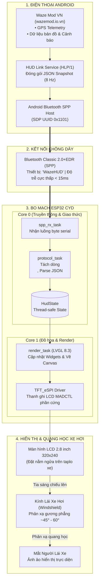

# 🔄 Mô hình Hoạt động Toàn diện: Waze Mod ➔ Bluetooth SPP ➔ HUD ➔ Kính Lái

Tài liệu này phân tích chi tiết nguyên lý hoạt động, kiến trúc luồng dữ liệu và cơ chế quang học của hệ thống **WazeHUD CYD** từ ứng dụng trên điện thoại cho tới mắt người lái xe.

---

## 1. Sơ đồ Kiến trúc Luồng Dữ liệu (End-to-End Pipeline)



---

## 2. Chặng 1: Waze Mod & Giao thức HLP/1 (HUD Link Protocol)

### 2.1. Nguồn dữ liệu từ Waze Mod
Ứng dụng **Waze Mod** (được cung cấp bởi cộng đồng [wazemod.io.vn](https://wazemod.io.vn/)) là một phiên bản đặc biệt được tích hợp sẵn service phát dữ liệu dẫn đường theo giao thức mở **HLP/1 (HUD Link Protocol)**.
- Khi bật tính năng **HUD Link** trong phần cài đặt Waze Mod, ứng dụng sẽ khởi chạy một background service quét và kết nối với thiết bị Bluetooth mang tên `WazeHUD`.
- Mỗi giây, Waze Mod gửi tới **8 gói tin trạng thái đầy đủ (Full Snapshot Stream)**, mỗi gói tin có kích thước tối đa 512 bytes và kết thúc bằng ký tự ngắt dòng `\n` (0x0A).

### 2.2. Cấu trúc gói tin Stream `s`
Một gói dữ liệu điển hình được gửi từ Waze Mod có định dạng JSON:
```json
{
  "v": 1,
  "t": "s",
  "spd": 58,
  "lim": 60,
  "over": false,
  "trn": 8,
  "dst": 284,
  "st": "Phạm Hùng",
  "st2": "Đường gom Đại lộ Thăng Long",
  "eta": "14:01",
  "rkm": 13.3,
  "alr": 3,
  "alrD": 270,
  "alrs": [{"k": 9, "d": 450, "v": 60}]
}
```

### 2.3. Các trường thông số cốt lõi:
| Trường | Ý nghĩa | Cách WazeHUD xử lý |
|---|---|---|
| `spd` | Tốc độ GPS thời gian thực (km/h) | Hiển thị số cực lớn ở giữa màn hình. Tự đổi sang màu đỏ rực khi `spd > lim` hoặc `over=true`. |
| `lim` | Tốc độ giới hạn trên đoạn đường (km/h) | Hiển thị bên trong biển tròn viền đỏ số đen chuẩn VN. Hệ thống áp dụng **bộ nhớ đệm giữ tốc độ gần nhất** để không bị chớp tắt khi đi vào đường chưa có dữ liệu tốc độ (`lim=0`). |
| `trn` / `dst` | Mã hướng rẽ & cự ly tới khúc rẽ (mét) | LVGL Canvas vẽ vector mũi tên Waze (Thân dày, rẽ góc vuông, rẽ chếch, vòng xuyến bùng binh, quay đầu U-Turn chữ U ngược). |
| `alr` / `alrD` | Loại cảnh báo chính & cự ly (mét) | Vẽ biểu tượng Camera giao thông kèm cột đèn tín hiệu (Đỏ - Vàng - Xanh), kèm nhãn khoảng cách to rõ màu vàng bên dưới. |
| `alrs` | Danh sách cảnh báo phụ tiếp theo | Hiển thị các biển cảnh báo nhỏ thu gọn ở góc phải. |
| `avg` / `avgL` | Đoạn đường cấm vượt tại Việt Nam | Thay thế thanh footer chuyến đi thành thanh đếm lùi cấm vượt: `CẤM VƯỢT (xxx m)`. |

---

## 3. Chặng 2: Bluetooth Classic SPP (Serial Port Profile)

WazeHUD lựa chọn **Bluetooth Classic SPP** làm phương thức truyền thông chính nhờ các ưu thế vượt trội:
1. **Zero-Configuration (Ghép đôi 1 chạm)**:
   - ESP32 phát quảng bá SDP với UUID chuẩn `0x1101` (Serial Port Profile) và tên thiết bị `"WazeHUD"`.
   - Người dùng chỉ cần ghép đôi một lần trong cài đặt Android, Waze Mod sẽ tự động kết nối lại mỗi khi lên xe.
2. **Băng thông & Độ trễ cực thấp**:
   - Tốc độ truyền 8 Hz (125 ms/gói tin) hoàn toàn mượt mà, không bị lag hay trễ nhịp tốc độ khi xe tăng/giảm ga đột ngột.
3. **Chống nghẽn bằng hàng đợi FreeRTOS**:
   - Khi có dữ liệu gửi đến, ngắt phần cứng của Bluetooth stack (Bluedroid) đẩy ngay các byte dữ liệu vào `g_hlp_rx_queue` và giải phóng ISR lập tức để không làm gián đoạn hệ thống.

---

## 4. Chặng 3: Kiến trúc Xử lý 2 Nhân bên trong ESP32 CYD

ESP32-2432S028 trang bị vi xử lý Xtensa LX6 lõi kép 240 MHz. Firmware chia tác vụ độc lập theo 2 nhân vật lý:

```text
[ Core 0: Giao thức & Mạng ]                [ Core 1: Render Đồ họa ]
┌───────────────────────────┐              ┌───────────────────────────┐
│ • spp_rx_task (Pri 6)     │              │ • render_task (Pri 4)     │
│ • wifi_rx_task (Pri 6)    │              │   - LVGL v8.3 Timer       │
│ • protocol_task (Pri 5)   │              │   - Canvas Vector Draw    │
│   (Parse JSON & Validate) │              │   - Touch Input Handler   │
└─────────────┬─────────────┘              └─────────────▲─────────────┘
              │                                          │
              └────────────► [ Mutex HudState ] ─────────┘
```

- **Core 1 dành trọn vẹn cho Đồ họa**: Giúp giao diện LVGL hiển thị ở tốc độ khung hình ổn định 30–60 FPS, việc tính toán render không bị ảnh hưởng bởi quá trình xử lý gói tin mạng.
- **Mutex Thread-Safe**: Dữ liệu từ Core 0 sang Core 1 được đồng bộ hóa qua khóa Mutex `g_state_mutex`, ngăn ngừa hoàn toàn tình trạng race-condition (đọc dữ liệu dở dang).

---

## 5. Chặng 4: Cơ chế Hắt Kính Lái (Windshield Optical HUD Mirroring)

### 5.1. Bài toán Quang học khi Hắt Kính
Khi đặt một màn hình phẳng nằm ngửa trên taplo xe hơi, ánh sáng từ màn hình phát lên và phản xạ qua bề mặt kính lái nghiêng (góc nghiêng thường từ 45° đến 60° so với mặt phẳng ngang) để đi vào mắt người lái:
- Theo định luật phản xạ gương phẳng, hình ảnh nhìn thấy trên kính lái là một **ảnh ảo (virtual image)** bị **nghịch đảo chiều không gian (Parity Inversion)** theo phương đối xứng qua gương.
- Nếu để màn hình ở chế độ hiển thị bình thường, khi nhìn lên kính lái toàn bộ chữ số sẽ bị ngược (như khi nhìn chữ trong gương soi: số `60` thành số ngược, chữ `Phạm Hùng` bị lật ngược từ phải sang trái).

### 5.2. Tại sao Xoay màn hình 180° (Vertical Rotation) là SAI?
Nhiều người lầm tưởng chỉ cần xoay màn hình 180 độ là có thể hắt kính được. Thực tế:
- **Xoay 180°**: Đảo ngược cả trục X lẫn trục Y. Kết quả: Màn hình bị lộn ngược đầu xuống đất! Khi phản xạ lên kính lái, chữ sẽ bị chúc ngược đỉnh đầu xuống dưới, hoàn toàn không đọc được.
- **Lật gương ngang (Horizontal Flip / Mirror)**: Chỉ đảo ngược trục hoành X, giữ nguyên trục tung Y. Khi tia sáng phản xạ qua kính lái thêm 1 lần nữa, hình ảnh ảnh ảo đi vào mắt người lái sẽ được đảo ngược lại thành hình ảnh hoàn toàn thuận mắt!

### 5.3. Giải pháp Điều khiển Phần cứng LCD MADCTL
Thay vì dùng thuật toán phần mềm để đảo từng điểm ảnh (gây nặng CPU và tụt khung hình), WazeHUD can thiệp trực tiếp vào thanh ghi điều khiển quét bộ nhớ phần cứng **MADCTL (Memory Access Data Control)** của chip điều khiển LCD (ILI9341 / ST7789):

```cpp
// Điều khiển lật gương chiều ngang ở tầng phần cứng:
void DisplayDriver::applyMirrorToHardware() {
    tft.startWrite();
    if (s_is_mirrored) {
        // Đảo cờ quét cột MX (Horizontal Flip): Quét từ phải sang trái
        tft.writecommand(0x36); // LCD MADCTL Register
        tft.writedata(0xE8);    // Lật ngược chiều ngang, giữ nguyên chiều đứng
    } else {
        // Chế độ nhìn trực tiếp chuẩn Landscape
        tft.writecommand(0x36);
        tft.writedata(0x28);
    }
    tft.endWrite();
}
```

### 5.4. Chuyển đổi 2 chế độ linh hoạt
Người lái xe có thể chuyển đổi qua lại giữa 2 chế độ:
1. **Chế độ Nhìn Thẳng (Dashboard Display)**: Gắn trên giá đỡ điện thoại/kẹp cửa gió điều hòa, nhìn trực tiếp vào màn hình CYD.
2. **Chế độ Hắt Kính (Windshield HUD Mirror)**: Đặt nằm ngửa trên miếng đệm chống trượt (anti-slip mat) sát chân kính lái, chữ phản chiếu trực tiếp lên kính lái.
   - Thao tác chuyển đổi cực nhanh bằng cách chạm vào nút **`LẬT`** trên màn hình cảm ứng hoặc bấm **nút cứng `BOOT` (GPIO 0)** ở mặt sau bo mạch.

---

👉 Xem tiếp: **[Hướng dẫn Cài đặt & Vận hành](./Setup-and-Usage-Guide.md)**
